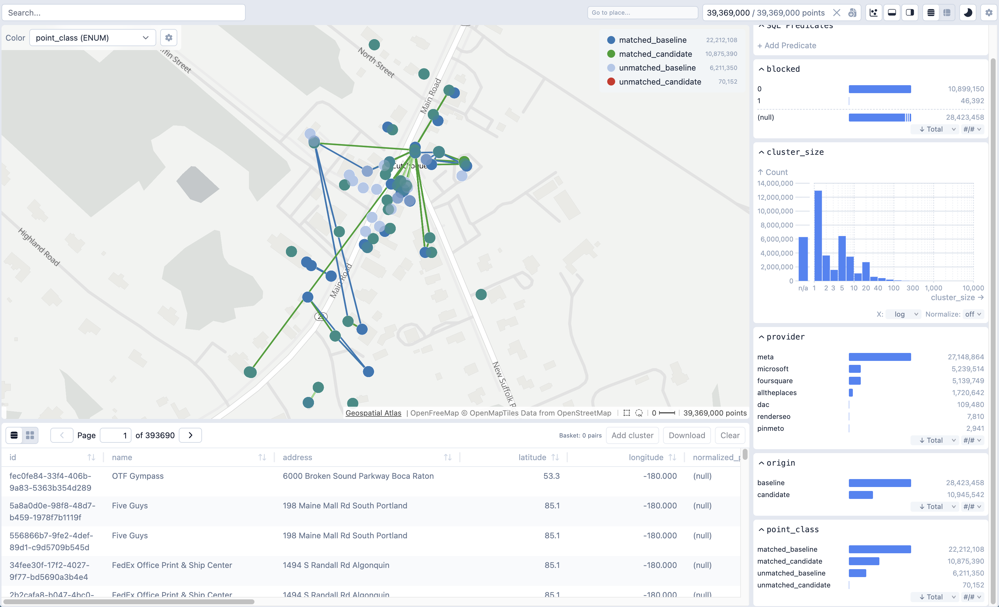
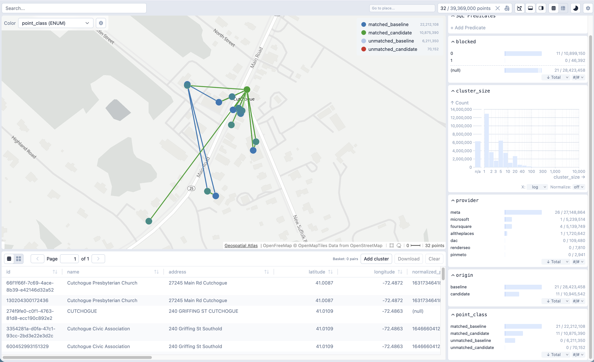

# Cluster Atlas

This is a fork of [Embedding Atlas](https://apple.github.io/embedding-atlas) and [Geospatial Atlas](https://github.com/do-me/geospatial-atlas) adapted for match-cluster analysis. 

## Inspecting match outputs (the main use case)

The primary aim of this fork is **visual inspection of matcher outputs** — the
candidate↔baseline links produced by an entity-matching run. A dedicated viewer
mode (`match-eval`) renders every POI colored by its **match class** and draws a
**Match Line** between each matched pair, so you can eyeball where the matcher
agrees, disagrees, and how clusters form.


What you see on the map:

- **Four point classes** — Matched Candidate, Unmatched Candidate, Matched
  Baseline, Unmatched Baseline — each in a distinct color.
- **Match Lines** connecting matched pairs, colored by pair type
  (candidate→baseline, candidate→candidate, baseline→baseline), with master and
  per-pair-type show/hide toggles. Lines are short, so they appear once you zoom
  in past a threshold.

The viewer consumes a pre-built **Expected Format** (a Points dataset + a Lines
dataset) and never joins at view time — this decoupling is what lets it scale to
tens of millions of matches. See [`CONTEXT.md`](CONTEXT.md) for the glossary and
[`docs/adr/`](docs/adr/) for the design decisions.

### General inspection

Everything is wired through a single **cross-filter**: select on any view and
every other view narrows to match. Brush a histogram, toggle a class in the
**legend**, draw a bounding box on the map, or search by name (full-text and, when
indexed, vector / nearest-neighbor) — the map, the Match Lines, and the table all
reduce to the same subset in lockstep, with a live filtered count and a one-click
**Reset filter**.

For anything the built-in widgets can't express, open **+ Add Predicate** and type
a raw **SQL `WHERE` clause** against the Points table (the editor autocompletes
table and column names). Name it and it joins the cross-filter like any other
clause, so you can stack `composite_score < 0.4`, `point_class = 'Unmatched
Candidate'`, `cluster_size > 5`, and a map box together. Every column from the
Expected Format is queryable, and the same SQL surface is exposed to LLM agents via
the MCP `run_sql_query` tool (see [Connect an LLM agent](#connect-an-llm-agent-claude-desktop-cursor-)).

### Inspecting clusters

A match **cluster** is the set of records sharing a `base_id` — one baseline and
every candidate matched against it (plus candidate↔candidate / baseline↔baseline
links). To inspect one, **click any point**: the viewer publishes a
`cluster_id IN (…)` clause to the global cross-filter, so the map hides every point
outside that cluster, only the cluster's Match Lines remain drawn, and the table
scrolls to exactly its rows — all on the first click. **Shift / ⌘-click** unions
several clusters into the selection; clicking empty map clears it.

<p>
  
  
</p>

*Before (left): the full 39 M-point dataset. After (right): one click filters the
map, Match Lines, table, and every side-panel chart down to the clicked point's
cluster (here 32 rows).*

This works because `cluster_id` ships as a column on the prebuilt Points dataset
and the click-to-filter is gated to matcher-eval views that carry it, so it no-ops
on generic point datasets. It is a fast way to answer "what else got pulled into
this match?" without writing any SQL.

### Downloading clusters as example cases

Selected clusters can be set aside as a labeled corpus of example cases. With a
cluster filtered (via click-to-filter above), a **cluster basket** appears over the
table: click **Add cluster** to accumulate that cluster's `id`↔`base_id` pairs into
a server-side `__cluster_basket` DuckDB table (read from the Lines dataset, scoped
to the active filter, deduped on `(id, base_id)`). Repeat across as many clusters
as you like — the basket is a real table on the shared connection, so the running
count is plain SQL and it survives a page reload within the session.

When done, **Download** exports the whole basket as `cluster-basket.parquet` (via
the same COPY-to-parquet endpoint the selection export uses), or **Clear** empties
it. The result is a compact parquet of hand-picked match clusters — ideal as
regression fixtures, hard-case examples, or a review queue for downstream work.

### Run it

**Build mode** — build the Expected Format from a local run directory containing
`candidates/`, `baseline/`, `matches/` and `blocking/` subfolders (DuckDB builds
and caches Points + Lines, then launches the viewer):

```bash
uv --directory packages/backend run geospatial-atlas-match-eval /path/to/RUN_DIR
```

**Prebuilt mode** — point at an already-built Expected Format (e.g. produced on
Databricks and downloaded, see
[`docs/databricks-prebuild-notebook-spec.md`](docs/databricks-prebuild-notebook-spec.md)).
Each of `--points`/`--lines` may be a single `.parquet`, a directory of parts, or
a glob:

```bash
uv --directory packages/backend run geospatial-atlas-match-eval \
  --points /path/to/points/ --lines /path/to/lines/
```

Useful flags: `--build-only` (build the Expected Format and exit), `--force`
(rebuild even if a valid cache exists), `--lines-min-zoom` (zoom threshold below
which Match Lines are hidden), `--port` / `--host`.

For exploring an arbitrary point dataset (without match inspection), use the
plain `geospatial-atlas` command described under [Usage](#usage-after-installation-above).

## Installation

```bash
git clone https://github.com/do-me/geospatial-atlas.git
cd geospatial-atlas
npm install
npm run build
```

Running on an Intel Mac? Then add this line to `packages/backend/pyproject.toml`:

`required-environments = ["sys_platform == 'darwin' and platform_machine == 'x86_64'"]`

For Windows, Silicon Macs and Linux everything should work out of the box.

## Usage (after installation above)

Execute this command directly from the root directory of the repository. The parquet file must either contain a geometry column or lat lon / latitude longitude columns.

```bash
uv --directory packages/backend run geospatial-atlas your_dataset_with_lat_lon_coords.parquet
```

If you have a small dataset (<5M places) you can add the `--text` flag to include a text column. Your names are then indexed and searchable. For large files this might cause out-of-memory errors.

```bash
uv --directory packages/backend run geospatial-atlas your_dataset_with_lat_lon_coords.parquet --text your_name_column
```

Alternatively you can cd into the backend folder and run it from there:

```
cd packages/backend
uv run geospatial-atlas your_dataset_with_lat_lon_coords.parquet --text your_name_column
```

## Testing

End-to-end tests use [Playwright](https://playwright.dev/) and cover both runtime modes (server mode with Python backend, and frontend-only mode with Vite dev server + DuckDB WASM).

**Prerequisites:**

```bash
npm run build              # server-mode tests need the built viewer
npx playwright install chromium
```

On first run the test suite auto-downloads a ~29 MB parquet fixture ([GISCO Education](https://github.com/do-me/geospatial-atlas-apps/tree/main/GISCO_Education)) and caches it in `e2e/.data/` (git-ignored). Override with `E2E_PARQUET_FILE=/path/to/file.parquet` if needed.

**Run all tests:**

```bash
npx playwright test
```

**Run a single mode:**

```bash
npx playwright test --project server-mode
npx playwright test --project frontend-mode
```

**View the HTML report** (generated on every run):

```bash
npx playwright show-report e2e/playwright-report
```

Test artifacts (traces, screenshots on failure, HTML report) are written to `e2e/test-results/` and `e2e/playwright-report/` — both git-ignored.

### Test structure

```
e2e/
├── helpers.ts                # Auto-download, server lifecycle, page helpers
├── server-mode.spec.ts       # Full-stack: Python backend + pre-built viewer
│   ├── API                   #   Metadata endpoint, DuckDB query
│   ├── Rendering             #   Scatter canvas, MapLibre basemap, sidebar
│   ├── Basemap Alignment     #   Mercator formula, point-vs-map consistency
│   ├── Interaction           #   Scroll-to-zoom
│   └── Zoom Drift            #   Scatter-vs-map pixel alignment across zoom levels
└── frontend-mode.spec.ts     # Browser-only: Vite dev server + DuckDB WASM
    ├── File Upload           #   Drop zone, parquet upload transition
    └── Test Data Viewer      #   Synthetic data scatter, UI controls
```

---

## Original Embedding Atlas Readme

[](https://www.npmjs.com/package/embedding-atlas)
[](https://pypi.org/project/embedding-atlas/)
[](https://arxiv.org/abs/2505.06386)
[](./LICENSE)

Embedding Atlas is a tool that provides interactive visualizations for large embeddings. It allows you to visualize, cross-filter, and search embeddings and metadata.

**Features**

- 🏷️ **Automatic data clustering & labeling:**
  Interactively visualize and navigate overall data structure.

- 🫧 **Kernel density estimation & density contours:**
  Easily explore and distinguish between dense regions of data and outliers.

- 🧊 **Order-independent transparency:**
  Ensure clear, accurate rendering of overlapping points.

- 🔍 **Real-time search & nearest neighbors:**
  Find similar data to a given query or existing data point.

- 🚀 **WebGPU implementation (with WebGL 2 fallback):**
  Fast, smooth performance (up to few million points) with modern rendering stack.

- 📊 **Multi-coordinated views for metadata exploration:**
  Interactively link and filter data across metadata columns.

Please visit <https://apple.github.io/embedding-atlas> for a demo and documentation.

<picture>
  <source media="(prefers-color-scheme: dark)" srcset="./packages/docs/public/assets/embedding-atlas-dark.png">
  
</picture>

## Get started

To use Embedding Atlas with Python:

```bash
pip install embedding-atlas

embedding-atlas <your-dataset.parquet>
```

In addition to the command line tool, Embedding Atlas is also available as a Python Notebook (e.g., Jupyter) widget:

```python
from embedding_atlas.widget import EmbeddingAtlasWidget

# Show the Embedding Atlas widget for your data frame:
EmbeddingAtlasWidget(df)
```

Finally, components from Embedding Atlas are also available in an npm package:

```bash
npm install embedding-atlas
```

```js
import { EmbeddingAtlas, EmbeddingView } from "embedding-atlas";

// or with React:
import { EmbeddingAtlas, EmbeddingView } from "embedding-atlas/react";

// or Svelte:
import { EmbeddingAtlas, EmbeddingView } from "embedding-atlas/svelte";
```

For more information, please visit <https://apple.github.io/embedding-atlas/overview.html>.

## BibTeX

For the Embedding Atlas tool:

```bibtex
@misc{ren2025embedding,
  title={Embedding Atlas: Low-Friction, Interactive Embedding Visualization},
  author={Donghao Ren and Fred Hohman and Halden Lin and Dominik Moritz},
  year={2025},
  eprint={2505.06386},
  archivePrefix={arXiv},
  primaryClass={cs.HC},
  url={https://arxiv.org/abs/2505.06386},
}
```

For the algorithm that automatically produces clusters and labels in the embedding view:

```bibtex
@misc{ren2025scalable,
  title={A Scalable Approach to Clustering Embedding Projections},
  author={Donghao Ren and Fred Hohman and Dominik Moritz},
  year={2025},
  eprint={2504.07285},
  archivePrefix={arXiv},
  primaryClass={cs.HC},
  url={https://arxiv.org/abs/2504.07285},
}
```

## Development

For development instructions, please visit <https://apple.github.io/embedding-atlas/develop.html>, or checkout `packages/docs/develop.md`.

## License

This code is released under the [`MIT license`](LICENSE).
